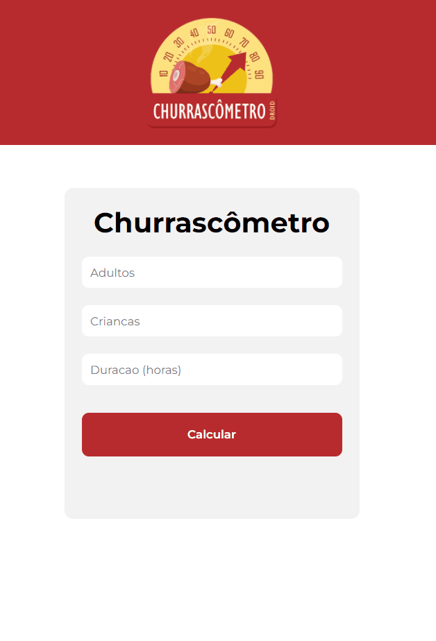

<!-- CAPA -->

<h1 align="center">
     
</h1>

<h1 align="center">
   CHURRASCÔMETRO
</h1>

<!--INDEX-->

  <a href="#-sobre-o-projeto">Sobre o projeto</a>&nbsp;&nbsp;&nbsp;|&nbsp;&nbsp;&nbsp;
  <a href="#-screenshots">Screenshots</a>&nbsp;&nbsp;&nbsp;|&nbsp;&nbsp;&nbsp;
  <a href="#rocket-tecnologias">Tecnologias</a>&nbsp;&nbsp;&nbsp;|&nbsp;&nbsp;&nbsp;
  <a href="#-tools">Tools</a>&nbsp;&nbsp;&nbsp;|&nbsp;&nbsp;&nbsp;
  <a href="#memo-license">License</a>

<!-- Tópicos -->

## 💻 Sobre o projeto

- Projeto desenvolvido durante o **Curso Programador BR**.
- Objetivo consiste em elaborar um sistema em JavaScript que calcula a quantidade necessária de comida e bebida para um churrasco.

## 📸 Screenshots

  

## :rocket: Tecnologias

This project was developed with the following technologies:

- [HTML]()
- [CSS]()
- [JavaScript]()

## ⛏ Tools
- [Visual Studio Code](https://code.visualstudio.com/)

## :memo: License

O projeto está sobre a licença [MIT](./LICENSE) ❤️ 

Gostou? Deixe uma estrelinha para ajudar o projeto ⭐

<!-- Mensagem final -->
<h3 align="center"> 
Feito com ❤️ por <a href="https://www.linkedin.com/in/matheusfbonfim/">Matheus Bonfim</a>
  
</h3>
</h3>
